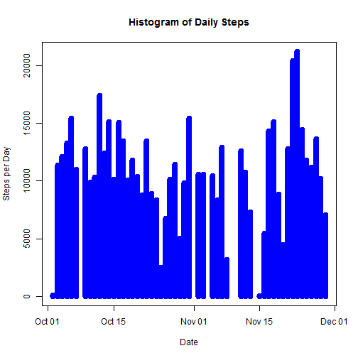
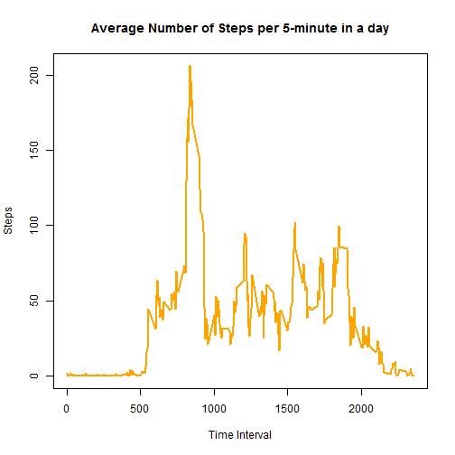
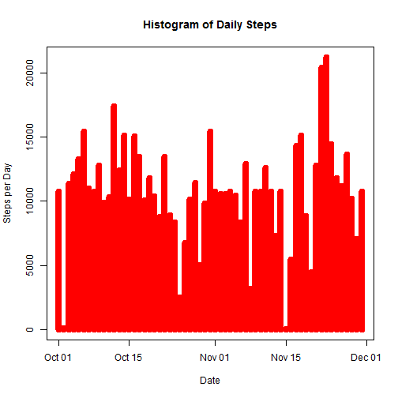

Reproducible Research Project 1
===============================

Borye

October 2014

### About

This was the first project for the **Reproducible Research** course in Coursera's Data Science specialization track. The purpose of the project was to answer a series of questions using Activity monitoring dataset.

### Loading and preprocessing the data


```r
setwd("C:/Users/bliap/Documents/R")
Data <- read.csv("./activity.csv", header = TRUE, sep = ",", na.string = "NA")
Data$date <- as.Date(Data$date)
```

### What is mean total number of steps taken per day

Make a histogram of the total number of steps taken each day


```r
steps_by_day <- aggregate(steps ~ date, Data, sum)     ## calculate the every day steps
plot(steps_by_day$date, steps_by_day$steps, type="h", main="Histogram of Daily Steps", xlab="Date", 
     ylab="Steps per Day", col="blue", lwd = 8)
```

 

Calculate and report the **mean** and **median** total number of steps taken per day


```r
paste("Mean Steps per Day =", mean(steps_by_day$steps, na.rm = TRUE))
```

```
## [1] "Mean Steps per Day = 10766.1886792453"
```

```r
paste("Median Steps per Day =", median(steps_by_day$steps, na.rm = TRUE))
```

```
## [1] "Median Steps per Day = 10765"
```

### What is the average daily activity pattern

Make a time series plot of the 5-minute interval (x-axis) and the average number of steps taken, averaged
acrossed all days (y-axis)


```r
steps_by_interval <- aggregate(steps ~ interval, Data, mean)
plot(steps_by_interval$interval, steps_by_interval$steps, type = "l", main = "Average Number of Steps per 5-minute in a day", xlab = "Time Interval", ylab = "Steps", col = "orange", lwd = 2)
```

 

Which 5-minute interval, on average across al the days in the dataset, contains the maximum number of steps


```r
paste("Maximum number of steps occurs at", steps_by_interval[which.max(steps_by_interval$steps), 1], "time interval")
```

```
## [1] "Maximum number of steps occurs at 835 time interval"
```

### Imputing missing values

Calculate and report the total number of missing values in the dataset


```r
paste("The total number of rows with missing value is", length(which(is.na(Data$steps))))
```

```
## [1] "The total number of rows with missing value is 2304"
```

Devise a strategy for filling in all the missing values. I will replace NAs with the mean for the particular interval number. 


```r
Data_new <- Data                 

## fill all the NAs with the mean of the particular interval number
for (i in 1:nrow(Data_new)){
    if (is.na(Data_new$steps[i]) == TRUE){
        Data_new$steps[i] <- steps_by_interval$steps[which(steps_by_interval$interval == Data_new$interval[i])]
        Data_new$steps[i] <- Data_new$steps[i]
    }
}

Data_new$date <- as.Date(Data_new$date)
```

Make a histogram of the total number of steps taken each day 


```r
steps_by_day_new <- aggregate(steps ~ date, Data_new, sum)     ## calculate the every day steps
plot(steps_by_day_new$date, steps_by_day_new$steps, type="h", main="Histogram of Daily Steps", xlab="Date", 
     ylab="Steps per Day", col="red", lwd = 8)
```

 

Calculate the **mean** and **median** for the new dataset


```r
paste("Imputed Mean Steps per Day =", mean(steps_by_day_new$steps, na.rm = TRUE))
```

```
## [1] "Imputed Mean Steps per Day = 10766.1886792453"
```

```r
paste("Imputed Median Steps per Day =", median(steps_by_day_new$steps, na.rm = TRUE))
```

```
## [1] "Imputed Median Steps per Day = 10766.1886792453"
```


* The difference between the imputed and original mean is 0
* The difference between the imputed and original median is 1.188

### Are there difference in activity patterns between weekdays and weekends

Create a new factor variable in the dataset with two levels - "weekday" and "weekend" indicating whether a given date ia a weekday or weekend day


```r
weekdays <- c("Monday", "Tuesday", "Wednesday", "Thursday", "Friday")
Data_new$week_weekend = as.factor(ifelse(is.element(weekdays(as.Date(Data_new$date)),weekdays), "Weekday", "Weekend"))
steps_by_interval_day <- aggregate(steps ~ interval + week_weekend, Data_new, mean)
library(lattice)
xyplot(steps_by_interval_day$steps ~ steps_by_interval_day$interval|steps_by_interval_day$week_weekend, main="Average Steps per Day by Interval",xlab="Interval", ylab="Steps",layout=c(1,2), type="l")
```

 
